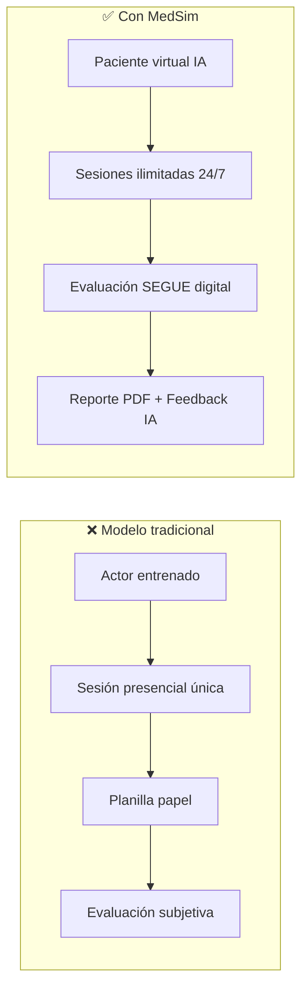
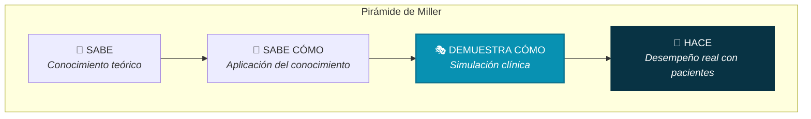
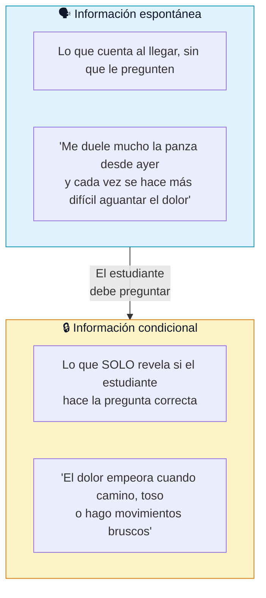
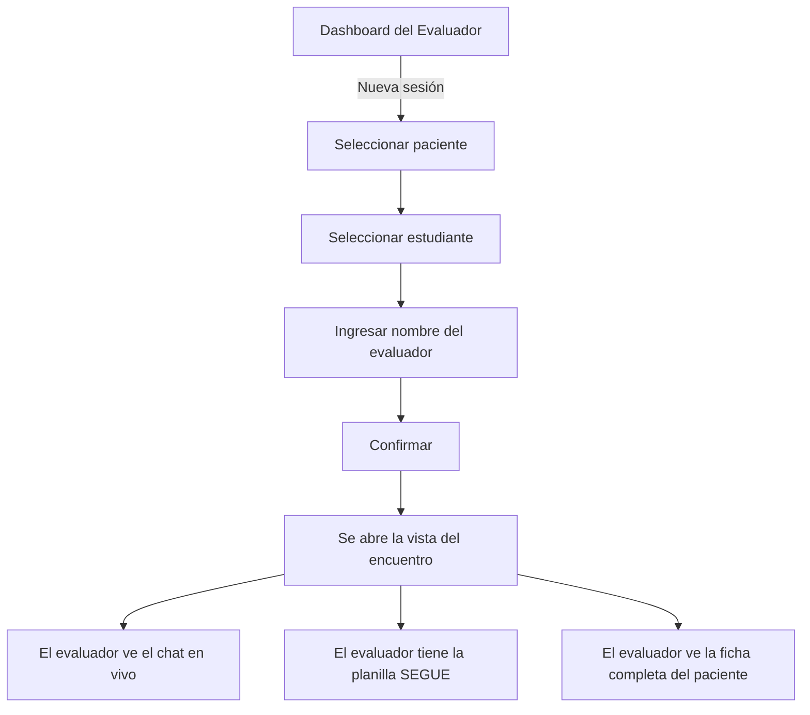
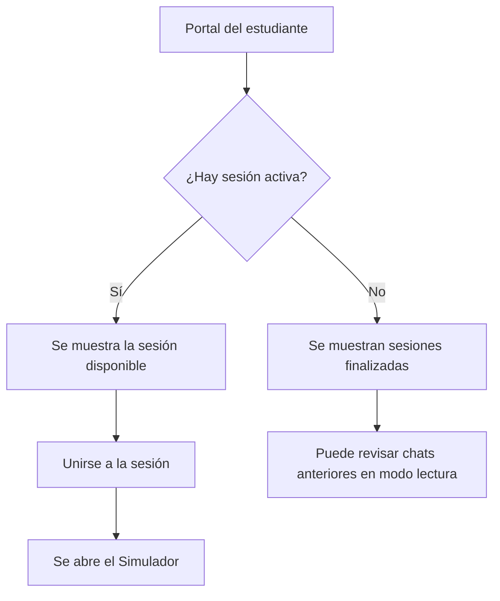

# 📘 MedSim — Manual de Capacitación

**Simulación de Entrevistas Clínicas con Pacientes Virtuales Inteligentes**

> Documento destinado a docentes evaluadores y estudiantes de la carrera de Medicina.
> Versión 1.0 — Agosto 2026

---

## Índice

| Etapa | Título | Dirigido a |
|-------|--------|------------|
| **1** | [Presentación: ¿Qué es MedSim?](#etapa-1--presentación-qué-es-medsim) | Todos |
| **2** | [Fundamento Pedagógico](#etapa-2--fundamento-pedagógico) | Todos |
| **3** | [El Marco SEGUE: Evaluar la Comunicación Clínica](#etapa-3--el-marco-segue-evaluar-la-comunicación-clínica) | Todos |
| **4** | [El Paciente Virtual: Cómo Funciona y Por Qué Actúa Así](#etapa-4--el-paciente-virtual-cómo-funciona-y-por-qué-actúa-así) | Todos |
| **5** | [Guía del Evaluador](#etapa-5--guía-del-evaluador) | Docentes |
| **6** | [Guía del Estudiante](#etapa-6--guía-del-estudiante) | Estudiantes |
| **7** | [El Reporte de Evaluación (PDF)](#etapa-7--el-reporte-de-evaluación-pdf) | Docentes |
| **8** | [Feedback Asistido por IA](#etapa-8--feedback-asistido-por-ia) | Docentes |
| **9** | [Actividades Prácticas Sugeridas](#etapa-9--actividades-prácticas-sugeridas) | Todos |
| **10** | [Preguntas Frecuentes](#etapa-10--preguntas-frecuentes) | Todos |

---

## Etapa 1 — Presentación: ¿Qué es MedSim?

### El desafío en la formación médica

Uno de los momentos más determinantes en la atención de un paciente ocurre antes de cualquier estudio complementario, antes de cualquier diagnóstico: ocurre en la **entrevista clínica**. Es ahí donde el profesional debe escuchar, preguntar, contener, interpretar y construir una relación de confianza que determinará la calidad del proceso de atención.

Sin embargo, entrenar esta competencia presenta desafíos concretos:

| Desafío tradicional | Consecuencia |
|---------------------|-------------|
| Se necesitan actores entrenados como *pacientes estandarizados* | Alto costo, baja disponibilidad, difícil de escalar |
| Cada sesión presencial es única e irrepetible | No se puede volver a practicar el mismo escenario |
| La evaluación depende de planillas en papel | Subjetiva, difícil de comparar, sin trazabilidad |
| Los alumnos practican pocas veces antes de enfrentar pacientes reales | Menor preparación, mayor ansiedad, potenciales errores |

### La solución: MedSim

**MedSim** es una plataforma de simulación clínica donde los estudiantes de medicina practican la anamnesis (entrevista clínica) conversando con un **paciente virtual inteligente** que responde de manera realista, en español rioplatense, y que mantiene coherencia con un caso clínico real prediseñado por la cátedra.

### ¿Qué se puede hacer con MedSim?

| Funcionalidad | Descripción |
|---------------|-------------|
| 💬 **Entrevistar por texto** | El estudiante escribe preguntas y el paciente responde naturalmente |
| 🎤 **Entrevistar por voz** | El estudiante habla con micrófono y el paciente responde con voz sintetizada |
| 📋 **Evaluar con Marco SEGUE** | El docente observa en vivo y completa la planilla de 25 ítems |
| 📄 **Generar reporte PDF** | Descarga profesional con puntaje, observaciones y datos del caso |
| 🤖 **Recibir feedback de IA** | Devolución cualitativa preliminar generada automáticamente |
| 🏥 **Crear casos clínicos** | Los docentes diseñan pacientes con historias clínicas completas |
| 👥 **Gestionar alumnos** | Registro de estudiantes asociados a sesiones y evaluaciones |

### ¿Qué hace único a MedSim?

A diferencia de otras herramientas de simulación, MedSim fue diseñado específicamente para el contexto de la cátedra argentina de medicina:

- **Habla como un paciente argentino real**: usa voseo, modismos locales y lenguaje coloquial
- **No usa jerga médica**: el paciente dice "me cuesta respirar", nunca "tengo disnea"
- **Revelación progresiva**: la información clínica no se entrega toda junta, el estudiante debe saber qué preguntar
- **Evaluación con estándar internacional**: usa el Marco SEGUE, validado globalmente
- **Accesible y simple**: funciona en cualquier navegador, sin instalar nada para los usuarios

---

## Etapa 2 — Fundamento Pedagógico

### La Pirámide de Miller

En 1990, George Miller propuso una jerarquía de niveles para evaluar las competencias médicas, conocida como la **Pirámide de Miller**:

MedSim opera en el nivel **"Demuestra cómo"**: el estudiante no solo sabe la teoría de cómo hacer una entrevista clínica, sino que la **practica activamente** en un entorno que simula la realidad. Este nivel es el puente esencial entre el conocimiento y la práctica real con pacientes.

### ¿Por qué simulación clínica?

La evidencia científica respalda ampliamente la simulación como herramienta pedagógica en medicina:

| Beneficio | Evidencia |
|-----------|-----------|
| **Entorno seguro** | Los estudiantes pueden equivocarse sin consecuencias para un paciente real |
| **Práctica repetible** | El mismo caso clínico puede practicarse múltiples veces hasta dominar la técnica |
| **Retroalimentación inmediata** | El docente observa en tiempo real y puede dar devolución estructurada |
| **Estandarización** | Todos los estudiantes enfrentan el mismo escenario con los mismos criterios |
| **Desarrollo de habilidades blandas** | Empatía, escucha activa y comunicación se entrenan mejor con interacción que con teoría |
| **Mayor confianza profesional** | La exposición repetida a situaciones simuladas reduce la ansiedad ante pacientes reales |

### ¿Por qué IA en lugar de actores?

Los pacientes estandarizados (actores entrenados) son el estándar de oro, pero tienen limitaciones que la IA complementa:

| Aspecto | Actor entrenado | Paciente virtual IA |
|---------|----------------|-------------------|
| **Disponibilidad** | Horarios coordinados | 24/7 |
| **Costo por sesión** | Alto | Mínimo |
| **Consistencia** | Variable entre sesiones | Idéntica repetibilidad del caso |
| **Escalabilidad** | Limitada por cantidad de actores | Ilimitada |
| **Registro automático** | No | Transcript completo guardado |
| **Empatía y calidez humana** | Superior | En desarrollo |

> **MedSim no reemplaza al paciente estandarizado humano.** Lo complementa, permitiendo que los estudiantes lleguen a las sesiones presenciales con más horas de práctica y mayor preparación.

---

## Etapa 3 — El Marco SEGUE: Evaluar la Comunicación Clínica

### ¿Qué es el Marco SEGUE?

El **Marco SEGUE** es un instrumento de evaluación desarrollado por el **Dr. Gregory Makoul** (2001) en la Northwestern University. Fue diseñado como una lista de cotejo basada en la evidencia para enseñar y evaluar las habilidades de comunicación médico-paciente.

El nombre **SEGUE** es un acrónimo que describe las cinco fases esenciales de toda consulta médica:

| Letra | Fase | Significado |
|-------|------|------------|
| **S** | *Set the stage* | **Preparar el escenario** — Crear las condiciones para una buena consulta |
| **E** | *Elicit information* | **Obtener información** — Explorar el motivo de consulta y la perspectiva del paciente |
| **G** | *Give information* | **Dar información** — Explicar, educar y responder dudas |
| **U** | *Understand the patient's perspective* | **Comprender la perspectiva** — Reconocer emociones, desafíos y experiencia del paciente |
| **E** | *End the encounter* | **Cerrar el encuentro** — Asegurar comprensión mutua y definir pasos a seguir |

### ¿Por qué se eligió SEGUE para MedSim?

| Criterio | Detalle |
|----------|---------|
| **Validación internacional** | Uno de los marcos más utilizados en facultades de medicina de América del Norte |
| **Alta confiabilidad** | Estudios han demostrado consistencia entre evaluadores |
| **Enfoque en comunicación** | Evalúa la interacción, no solo el conocimiento clínico |
| **Uso en OSCE** | Compatible con Exámenes Clínicos Objetivos Estructurados |
| **Estructura clara** | 25 ítems organizados en 5 áreas, fácil de aplicar y enseñar |
| **Facilita el debriefing** | Cada ítem se convierte en un punto de reflexión post-sesión |

### Los 25 ítems SEGUE en detalle

A continuación se presenta la planilla completa que el evaluador utiliza en MedSim. Cada ítem se marca como **Sí** (✓), **No** (✗) o **No Corresponde** (—):

---

### 🤝 Área 1: Conectar con el paciente (5 ítems)

Esta fase establece el tono de toda la consulta. Un saludo adecuado, una presentación clara y la generación de un espacio de confianza son la base sobre la que se construye el resto de la entrevista.

| # | Criterio | ¿Qué observar? |
|---|----------|----------------|
| 1 | Saluda adecuadamente al paciente | ¿Se presenta? ¿Usa un tono cálido y profesional? |
| 2 | Establece el motivo de consulta | ¿Pregunta abiertamente por qué viene? |
| 3 | Establece agenda y secuencia de problemas | ¿Organiza la consulta antes de profundizar? |
| 4 | Establece conexión personal más allá de lo médico | ¿Muestra interés por la persona, no solo por la enfermedad? |
| 5 | Genera privacidad. Si habrá interrupción, lo anticipa | ¿Asegura un espacio de confianza? |

> **¿Por qué importa?** Los primeros 30 segundos de una consulta determinan el nivel de confianza del paciente. Un estudiante que no saluda o que empieza directamente con preguntas técnicas pierde información valiosa que el paciente solo comparte cuando se siente cómodo.

---

### 🔍 Área 2: Obtener información (10 ítems)

Esta es el área más extensa porque representa el núcleo de la anamnesis: la capacidad del futuro profesional de explorar sistemáticamente el cuadro clínico y la experiencia del paciente.

| # | Criterio | ¿Qué observar? |
|---|----------|----------------|
| 6 | Recoge la perspectiva del paciente sobre su problema | ¿Pregunta qué piensa el paciente que le pasa? |
| 7 | Explora signos, síntomas, factores físicos y fisiológicos | ¿Hace una exploración sistémica? |
| 8 | Explora factores psicosociales, situación familiar y estrés | ¿Indaga más allá de lo orgánico? |
| 9 | Indaga sobre tratamientos previos o historia del padecimiento | ¿Pregunta por lo que ya se hizo? |
| 10 | Indaga cómo los problemas de salud afectan la vida del paciente | ¿Entiende el impacto funcional? |
| 11 | Indaga estrategias de prevención y estilo de vida | ¿Piensa en prevención? |
| 12 | Hace preguntas directas. Evita preguntas directivas o capciosas | ¿Las preguntas son neutras? |
| 13 | Da tiempo para que el paciente hable, no interrumpe | ¿Permite que se exprese? |
| 14 | Escucha. Presta toda la atención. Parafrasea y/o repregunta | ¿Demuestra escucha activa? |
| 15 | Chequea y/o clarifica información | ¿Verifica lo que entendió? |

> **¿Por qué importa?** Un paciente real no entrega su historia clínica en una planilla. La revela fragmentariamente, en desorden, mezclada con emociones y preconceptos. El estudiante debe aprender a navegar esa complejidad.

---

### 📢 Área 3: Dar información (4 ítems)

El médico no solo recibe información: también debe explicar, educar y asegurar que el paciente comprenda.

| # | Criterio | ¿Qué observar? |
|---|----------|----------------|
| 16 | Explica la justificación de exámenes o procedimientos | ¿Explica el "para qué"? |
| 17 | Enseña al paciente sobre su cuerpo y situación | ¿Educa en lenguaje accesible? |
| 18 | Alienta al paciente para que realice preguntas | ¿Invita a participar? |
| 19 | Se adapta al nivel de comprensión del paciente | ¿Ajusta su lenguaje? |

> **¿Por qué importa?** La adherencia al tratamiento está directamente relacionada con cuánto comprende el paciente sobre su condición. Un médico que no explica genera desconfianza, abandono de tratamiento y peores resultados clínicos.

---

### 💛 Área 4: Comprensión de la perspectiva del paciente (4 ítems)

Esta área evalúa la dimensión empática y humana de la consulta.

| # | Criterio | ¿Qué observar? |
|---|----------|----------------|
| 20 | Reconoce los logros, el progreso y los desafíos del paciente | ¿Valida su experiencia? |
| 21 | Reconoce el tiempo de espera | ¿Muestra consideración? |
| 22 | Expresa cuidado, preocupación y empatía | ¿Se percibe genuinamente preocupado? |
| 23 | Mantiene un tono respetuoso | ¿Es respetuoso durante toda la consulta? |

> **¿Por qué importa?** La empatía médica no es un "extra amable": es una competencia clínica. Los pacientes que se sienten escuchados revelan más información, adhieren mejor al tratamiento y experimentan mejores resultados terapéuticos.

---

### 🏁 Área 5: Cierre (2 ítems)

El cierre adecuado asegura que el paciente se va con claridad sobre los próximos pasos.

| # | Criterio | ¿Qué observar? |
|---|----------|----------------|
| 24 | Pregunta si hay algo más que quiera discutir o preguntar | ¿Cierra con apertura? |
| 25 | Revisa nuevos pasos a seguir | ¿Deja claro el plan de acción? |

> **¿Por qué importa?** Un cierre pobre deja al paciente con dudas, genera consultas repetidas innecesarias y puede derivar en errores de interpretación del plan terapéutico.

---

## Etapa 4 — El Paciente Virtual: Cómo Funciona y Por Qué Actúa Así

### Principios de diseño del paciente

El paciente virtual de MedSim no es un chatbot genérico. Fue diseñado siguiendo principios pedagógicos específicos que buscan replicar las condiciones reales de una consulta médica:

### Principio 1: Lenguaje coloquial y regional

El paciente habla como un paciente real argentino: usa **voseo** ("vos tenés", "decime"), modismos ("panza" en vez de "abdomen", "pastilla" en vez de "fármaco") y expresiones cotidianas.

| ❌ Lo que el paciente NUNCA dice | ✅ Lo que el paciente SÍ dice |
|----------------------------------|-------------------------------|
| "Presento disnea de esfuerzo" | "Me cuesta respirar cuando camino" |
| "Tengo cefalea holocraneana" | "Me duele toda la cabeza" |
| "Padezco hipertensión arterial" | "Me dijeron que tengo la presión alta" |
| "Experimento arritmia cardíaca" | "Siento que el corazón me late raro" |

> **¿Por qué?** Si el paciente usara terminología médica, el estudiante no necesitaría formular preguntas de seguimiento para comprender el cuadro. El valor pedagógico reside en que el estudiante debe **traducir** lo que el paciente describe en términos coloquiales a una interpretación clínica.

### Principio 2: Revelación progresiva de información

Cada paciente tiene dos niveles de información:

> **¿Por qué?** En la realidad, un paciente no entrega un informe organizado de su historial. Cuenta lo que le parece relevante (información espontánea) y guarda detalles que solo emergen ante la pregunta correcta (información condicional). Esta mecánica entrena la **competencia de exploración** evaluada en los ítems 6-15 del SEGUE.

### Principio 3: El paciente no sabe su diagnóstico

El paciente virtual tiene un **problema médico real** definido por la cátedra (por ejemplo: apendicitis aguda). Sin embargo, el paciente **no conoce ni puede nombrar** ese diagnóstico. Si el estudiante le pregunta "¿Puede ser apendicitis?", el paciente responderá algo como:

> *"No sé, doctor, usted es el que sabe... yo pensé que era algo que comí"*

> **¿Por qué?** Un paciente real no se auto-diagnostica con terminología médica. Si la IA confirmara o negara diagnósticos, el estudiante dejaría de razonar clínicamente y simplemente le "preguntaría" al paciente qué tiene.

### Principio 4: Comportamiento natural y variable

| Rasgo | Lo que hace el paciente |
|-------|------------------------|
| **Respuestas cortas** | 1 a 3 frases por turno, como en una conversación real |
| **No se repite** | Varía las palabras aunque la información sea la misma |
| **Puede no recordar** | Ante preguntas sobre detalles lejanos dice "No me acuerdo bien, doctor" |
| **Tiene personalidad** | Puede ser ansioso, tranquilo, evasivo — según cómo se diseñe el caso |
| **Trata al médico con respeto** | Usa "usted" con profesionales mayores, "vos" con jóvenes |

### Ejemplo: el caso de Lucas Fernández

MedSim viene con un caso demo pre-cargado que sirve como modelo para los docentes:

| Campo | Valor |
|-------|-------|
| **Nombre** | Lucas Fernández |
| **Edad** | 21 años |
| **Motivo de consulta** | "Doctor, me duele muchísimo la panza desde ayer" |
| **Personalidad** | Ansioso |
| **Habla** | Rioplatense |
| **Problema real** | Apendicitis aguda |
| **Lo que cuenta solo si le preguntan** | "El dolor empeora cuando camino, toso o hago movimientos bruscos. No tuve diarrea." |
| **Diagnósticos diferenciales** | Gastroenteritis, Cólico renal, Diverticulitis, Adenitis mesentérica |

---

## Etapa 5 — Guía del Evaluador

### Pantalla de inicio

Al ingresar a MedSim, el docente selecciona **"Entrar como evaluador/a"**, lo que lo lleva al **Dashboard del Evaluador**, el centro de operaciones de la plataforma.

### 5.1 Gestionar el banco de pacientes

Desde el menú de **Pacientes**, el docente puede crear los casos clínicos que alimentan las simulaciones.

**Crear un paciente nuevo implica completar:**

1. **Datos de identificación** — Nombre, edad, DNI, obra social, sexo, ocupación
2. **Triage** — Motivo de consulta resumido (lo que ve el profesional de guardia)
3. **Historia clínica institucional** — Diagnósticos previos, cirugías, alergias, medicación actual
4. **Estudios recientes** — Laboratorios, imágenes, notas clínicas
5. **Lo que siente el paciente** — Descripción subjetiva en lenguaje coloquial
6. **Información espontánea** — Lo que comparte sin que le pregunten
7. **Información condicional** — Lo que solo revela si le preguntan directamente
8. **Síntomas** — Con nombre, severidad (1-10) y duración en días
9. **Resolución del caso** — Diagnóstico principal, diferenciales, plan terapéutico
10. **Personalidad y lenguaje** — Cómo se comporta y habla el paciente

> **Consejo para docentes:** Dediquen especial atención a la separación entre *información espontánea* e *información condicional*. Esa división es lo que convierte un caso en un ejercicio de entrenamiento efectivo.

### 5.2 Gestionar estudiantes

Desde el menú de **Estudiantes**, se registran los alumnos con su nombre y legajo/DNI. Estos datos aparecen luego en las sesiones y en los reportes PDF de evaluación.

### 5.3 Iniciar una sesión de simulación

Una vez creada la sesión:
- El **estudiante** puede unirse desde su portal y empezar a conversar
- El **evaluador** observa el chat en tiempo real y completa la evaluación SEGUE

### 5.4 Evaluar con la planilla SEGUE

En la vista del encuentro, el evaluador tiene dos paneles:

| Panel izquierdo | Panel derecho |
|----------------|---------------|
| Transcript completo del chat | Planilla SEGUE con los 25 ítems |
| Se actualiza en tiempo real | Cada ítem se marca como Sí / No / N/C |
| Incluye audios reproducibles | Campo de notas por cada ítem |

La evaluación **se guarda automáticamente** a medida que el docente marca los ítems. No es necesario presionar "Guardar".

### 5.5 Controlar el ciclo de la sesión

| Acción | Qué sucede |
|--------|-----------|
| **Finalizar sesión** | El estudiante ya no puede enviar mensajes. El chat queda en modo lectura. |
| **Reactivar sesión** | Se vuelve a habilitar el chat para el estudiante. |
| **Eliminar sesión** | Se borra toda la sesión, incluyendo chat, evaluación y audios. **Acción irreversible.** |

---

## Etapa 6 — Guía del Estudiante

### Ingreso a MedSim

Desde la pantalla de inicio, el estudiante selecciona **"Entrar como estudiante"**, lo que lo lleva al **Portal del Estudiante**.

### 6.1 Unirse a una sesión

### 6.2 La pantalla del simulador

Al ingresar a una sesión activa, el estudiante ve:

| Zona | Contenido |
|------|-----------|
| **Chat central** | Conversación con el paciente virtual |
| **Panel clínico lateral** | Ficha visible del paciente (nombre, edad, motivo de consulta, estudios, síntomas) |
| **Barra de entrada** | Campo de texto para escribir o botón de micrófono para hablar |

### 6.3 Conversar por texto

1. Escribir la pregunta o comentario en el campo de texto
2. Presionar Enter o el botón de enviar
3. Esperar la respuesta del paciente (aparece en pocos segundos)
4. La conversación completa queda guardada automáticamente

### 6.4 Conversar por voz

1. Presionar el botón del micrófono 🎤
2. Hablar con claridad (el sistema transcribe lo que se dice)
3. Al soltar el botón, el paciente procesa la pregunta
4. La respuesta se reproduce como audio Y se muestra como texto
5. Los audios quedan guardados y pueden reproducirse luego

> **Recomendaciones para la entrevista:**
> - Empezá saludando al paciente y presentándote
> - Preguntá abiertamente por qué vino antes de hacer preguntas específicas
> - Escuchá (leé) la respuesta completa antes de formular la siguiente pregunta
> - No le preguntes al paciente qué diagnóstico cree tener
> - Cerrá la consulta preguntando si tiene alguna duda

### 6.5 El panel clínico

El panel lateral muestra **solo la información que tendría disponible un profesional al recibir al paciente**:

- Datos administrativos (nombre, edad, obra social)
- Motivo de consulta registrado en triage
- Historia clínica institucional (antecedentes, alergias, medicación)
- Estudios complementarios disponibles
- Síntomas reportados al ingreso

> **Importante:** El panel clínico NO muestra el diagnóstico real, la información condicional ni la resolución del caso. Esa información solo la ve el evaluador.

### 6.6 Sesión finalizada

Cuando el evaluador finaliza la sesión:
- Aparece un aviso de que la conversación fue cerrada
- El chat queda disponible en modo lectura
- Ya no se pueden enviar mensajes nuevos
- Se puede acceder al historial desde "Sesiones finalizadas"

---

## Etapa 7 — El Reporte de Evaluación (PDF)

### ¿Qué contiene el PDF?

El evaluador puede descargar en cualquier momento un reporte profesional en formato PDF que incluye:

| Sección | Contenido |
|---------|-----------|
| **Encabezado** | "Reporte de Evaluación de Competencias Clínicas — Marco SEGUE" |
| **Datos del encuentro** | Nombre del estudiante, DNI/Legajo, Evaluador, Paciente simulado |
| **Score global** | Cantidad de ítems cumplidos sobre el total (ej: 18/25 — 72%) |
| **Tabla de evaluación** | Los 25 ítems organizados por área, con marcas ✓/✗/— y notas |
| **Observaciones** | Notas de retroalimentación que el docente escribió por ítem |

### ¿Cómo se calcula el puntaje?

| Métrica | Cálculo |
|---------|---------|
| **Ítems cumplidos** | Cantidad de ítems marcados como "Sí" |
| **Total evaluable** | Total de 25 ítems del catálogo SEGUE |
| **Porcentaje** | (Ítems cumplidos / 25) × 100 |

> Los ítems marcados como "No Corresponde" se cuentan como no cumplidos en el porcentaje general. Esto asegura que el puntaje sea comparable entre sesiones distintas.

### ¿Cuándo descargar el PDF?

El PDF se genera **en el momento de la descarga**, reflejando el estado actual de la evaluación. Esto significa que:

- Se puede descargar en cualquier momento, incluso con la evaluación incompleta
- Si se modifica la evaluación después, se puede descargar una versión actualizada
- No es necesario "cerrar" la evaluación para generar el PDF

---

## Etapa 8 — Feedback Asistido por IA

### ¿Qué es?

MedSim incluye una funcionalidad donde la **Inteligencia Artificial analiza el transcript de la conversación** y genera una devolución cualitativa para el estudiante basada en los criterios SEGUE.

### ¿Qué ofrece el feedback automático?

- Una **impresión general** sobre cómo fue la comunicación clínica
- Un tono **profesional y constructivo**, orientado a motivar la práctica
- Una extensión breve (máximo 3 párrafos)

### ¿Qué NO hace el feedback automático?

| Lo que NO hace | ¿Por qué? |
|---------------|-----------|
| No da una nota numérica | Evita reducir competencias complejas a un número |
| No señala fallos específicos | Ese rol le corresponde al docente, que tiene contexto pedagógico |
| No reemplaza la evaluación SEGUE | Es un complemento preliminar, no un sustituto |
| No evalúa contenido clínico | Se enfoca en la comunicación, no en si el diagnóstico es correcto |

### ¿Cómo usarlo pedagógicamente?

El feedback de IA es más valioso como **disparador de reflexión** en la instancia de debriefing:

1. El docente lee el feedback al grupo después de la sesión
2. Pregunta al estudiante si está de acuerdo con la apreciación
3. Contrasta el feedback automático con la evaluación SEGUE manual
4. Discute las diferencias entre lo que percibió la IA y lo que observó el docente

> **El juicio pedagógico del docente siempre tiene la última palabra.** La IA es una herramienta de apoyo, no una autoridad evaluadora.

---

## Etapa 9 — Actividades Prácticas Sugeridas

### 🏥 Actividad 1 — Primer contacto con MedSim

**Duración:** 45 minutos  
**Objetivo:** Familiarizar al grupo con la plataforma y realizar una primera entrevista guiada.  
**Participantes:** Docente + grupo de estudiantes

| Paso | Tiempo | Descripción |
|------|--------|-------------|
| 1 | 5 min | El docente presenta MedSim: qué es, para qué sirve, cómo se ingresa |
| 2 | 5 min | Proyecta el Dashboard del Evaluador y muestra la sesión demo |
| 3 | 5 min | Un estudiante voluntario ingresa al Portal del Estudiante y se une a la sesión |
| 4 | 15 min | El estudiante realiza la anamnesis al paciente "Lucas Fernández" por texto |
| 5 | 5 min | El docente muestra en proyector cómo va viendo el transcript en tiempo real |
| 6 | 5 min | El docente completa algunos ítems SEGUE en vivo como demostración |
| 7 | 5 min | Se descarga el PDF de evaluación y se analiza en conjunto |

**Para reflexionar al final:**
- ¿Qué preguntas hizo bien el estudiante? ¿Cuáles le faltaron?
- ¿El paciente reveló toda la información? ¿Qué quedó sin preguntar?
- ¿Cómo fue el saludo y el cierre?

---

### 🎤 Actividad 2 — Entrevista por voz

**Duración:** 30 minutos  
**Objetivo:** Practicar la entrevista oral, más cercana a la realidad clínica.  
**Requisito:** Audio habilitado en la plataforma

| Paso | Tiempo | Descripción |
|------|--------|-------------|
| 1 | 5 min | El docente verifica que el audio funcione y explica el uso del micrófono |
| 2 | 20 min | El estudiante graba sus preguntas hablando y escucha las respuestas del paciente |
| 3 | 5 min | Revisión grupal: comparar lo que el estudiante dijo vs lo que se transcribió |

**Para reflexionar al final:**
- ¿La entrevista fue más natural hablando que escribiendo?
- ¿El estudiante organizó mejor sus preguntas o improvisó más?
- ¿Cómo se sintió "hablarle" a un paciente virtual?

---

### ✍️ Actividad 3 — Diseñar un caso clínico (para docentes)

**Duración:** 60 minutos  
**Objetivo:** Que los docentes aprendan a crear casos clínicos pedagógicamente efectivos.

| Paso | Tiempo | Descripción |
|------|--------|-------------|
| 1 | 10 min | Analizar juntos la estructura del caso "Lucas Fernández" |
| 2 | 10 min | Discutir: ¿qué información va en "espontánea" y qué en "condicional"? |
| 3 | 20 min | Cada docente diseña un caso nuevo usando el formulario de pacientes |
| 4 | 10 min | Crear una sesión con el caso nuevo y probarlo con una entrevista rápida |
| 5 | 10 min | Ajustar: ¿la personalidad es la correcta? ¿Falta información condicional? |

**Preguntas guía para el diseño:**
- ¿Qué competencias SEGUE quiero evaluar con este caso?
- ¿Qué debería preguntar un estudiante competente que uno novato no preguntaría?
- ¿La información condicional es lo suficientemente rica para diferenciar niveles?

---

### 📋 Actividad 4 — Evaluación cruzada con SEGUE

**Duración:** 90 minutos  
**Objetivo:** Practicar la evaluación estructurada y la reflexión grupal.

| Paso | Tiempo | Descripción |
|------|--------|-------------|
| 1 | 5 min | El docente presenta el Marco SEGUE y explica cada área |
| 2 | 20 min | Un estudiante realiza la entrevista mientras un compañero observa |
| 3 | 20 min | El observador completa la planilla SEGUE desde la vista del evaluador |
| 4 | 15 min | Se descargan los PDFs y se comparan las observaciones |
| 5 | 15 min | Discusión: ¿en qué ítems hubo acuerdo? ¿En cuáles no? ¿Por qué? |
| 6 | 15 min | Se muestra el feedback de IA y se contrasta con la evaluación manual |

**Para reflexionar al final:**
- ¿Es fácil o difícil ser objetivo evaluando a un par?
- ¿Qué criterios SEGUE fueron los más difíciles de observar?
- ¿Coincide lo que dice la IA con lo que vio el observador?

---

## Etapa 10 — Preguntas Frecuentes

### Sobre la plataforma

**¿Necesito instalar algo en mi computadora para usar MedSim?**  
No. MedSim funciona en cualquier navegador web moderno (Chrome, Firefox, Edge). Solo se necesita la dirección URL que proporcione la cátedra.

**¿Puedo usar MedSim desde el celular?**  
La interfaz está diseñada principalmente para computadoras, pero es accesible desde dispositivos móviles con navegador.

**¿Las conversaciones se guardan?**  
Sí. Todo el historial de chat, los audios y las evaluaciones se guardan automáticamente y están disponibles para su revisión posterior.

---

### Sobre el paciente virtual

**¿El paciente siempre responde lo mismo?**  
No. Las respuestas varían en forma y expresión, pero mantienen coherencia con el caso clínico definido. Dos sesiones sobre el mismo caso nunca serán idénticas.

**¿Puede el paciente equivocarse o inventar datos?**  
El paciente tiene instrucciones estrictas de no inventar antecedentes, alergias ni datos que no estén en su historia clínica. Si le preguntan por algo que no está definido, dirá que no lo sabe o no lo recuerda.

**¿Por qué el paciente habla como argentino?**  
Porque MedSim fue diseñado para el contexto de formación local. Un paciente que habla con el dialecto de la región genera una experiencia más realista y significativa para los estudiantes.

**¿El paciente puede darme el diagnóstico si le pregunto?**  
No. El paciente no conoce su diagnóstico técnico. Si se le pregunta directamente, responderá desde su perspectiva de paciente lego ("No sé, doctor, usted es el que sabe").

---

### Sobre la evaluación

**¿Puedo cambiar una evaluación después de guardarla?**  
Sí. La evaluación se actualiza cada vez que se modifica un ítem. Siempre refleja el último estado.

**¿Puedo descargar el PDF más de una vez?**  
Sí. El PDF se genera al momento de la descarga. Si se hacen cambios, la próxima descarga reflejará la versión actualizada.

**¿El feedback de IA puede reemplazar la evaluación del docente?**  
No. El feedback automático es una herramienta de apoyo. La evaluación oficial es la que realiza el docente con la planilla SEGUE.

**¿Qué pasa si no completo todos los ítems SEGUE?**  
Los ítems no completados se marcan como "No Corresponde". El PDF se puede generar con cualquier cantidad de ítems evaluados.

---

### Sobre las sesiones

**¿Puede un estudiante practicar solo, sin evaluador?**  
Sí, siempre que exista una sesión activa asignada. El estudiante puede conversar libremente con el paciente. La evaluación SEGUE es opcional y la realiza el evaluador.

**¿Se puede reabrir una sesión que ya terminó?**  
Sí. El evaluador puede reactivar cualquier sesión finalizada para que el estudiante pueda continuar la entrevista.

**¿Qué pasa si se elimina una sesión?**  
Se borran todos los datos asociados: chat, audios y evaluación. Esta acción no se puede deshacer.

---

*MedSim — Simulación clínica para la formación de profesionales que saben escuchar.*

*Documento de capacitación v1.0 — Agosto 2026*
