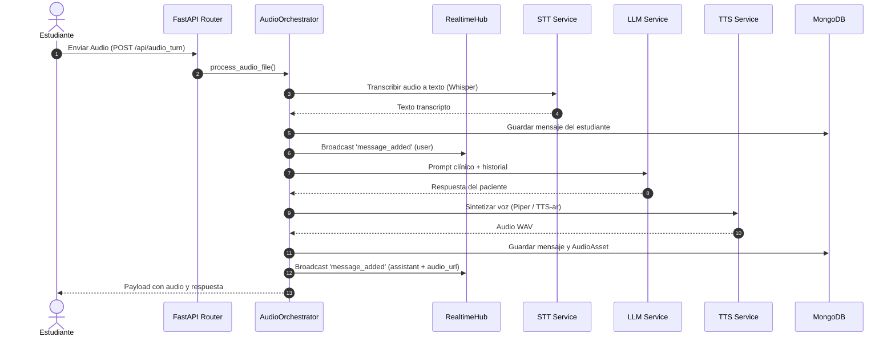

# Documentación Técnica Integral de MedSim

## 1. Arquitectura General del Sistema

MedSim es una plataforma de simulación clínica interactiva diseñada para evaluar habilidades de comunicación y diagnóstico médico mediante pacientes virtuales impulsados por IA (LLM, STT y TTS).

```mermaid
graph TD
    Client[Navegador / React SPA] -->|HTTP / SPA Routes| FastAPI[FastAPI Server]
    Client -->|WebSocket /ws/encounters/{id}| RealtimeHub[Encounter Realtime Hub]
    Unreal[Unreal Engine LAN] -->|POST /api/audio/audio_unreal| UnrealHandler[Unreal Audio Handler]
    
    FastAPI --> AuthMiddleware[SiteAuthMiddleware]
    FastAPI --> APIRouters[API Routers: Patients, Students, Encounters, Chat, Evaluations]
    
    APIRouters --> Services[Service Layer / ServiceContainer]
    Services --> AudioOrchestrator[Audio Orchestrator]
    Services --> AutoEvaluationService[Auto Evaluation Service]
    Services --> Repositories[Repository Layer / Motor AsyncIO]
    
    Repositories --> MongoDB[(MongoDB Database)]
    AudioOrchestrator --> LLMService[LLM Service: Groq / OpenAI / Ollama]
    AudioOrchestrator --> STTService[STT Service: Whisper]
    AudioOrchestrator --> TTSService[TTS Service: Piper TTS-ar / Cartesia]
```

---

## 2. Flujos Principales de la Aplicación

### 2.1 Flujo de Autenticación y Seguridad
1. **Verificación de Sesión**:
   * Si `SITE_PASSWORD` está configurado en el servidor, toda solicitud web que no provenga de prefijos públicos (`/login`, `/auth/`, `/assets/`, `/IMG/`, `/favicon`, `/api/config_state`, `/api/audio/audio_unreal`) requiere una cookie de sesión válida `medsim_session`.
   * Si no está autenticado, el usuario es redirigido a `/login?next={url_solicitada}`.
2. **Inicio de Sesión**:
   * El usuario envía la contraseña a `POST /auth/login`.
   * El servidor valida la clave contra `SITE_PASSWORD` y firma una cookie HMAC-SHA256 con timestamp usando `SECRET_KEY`.
   * Si `SECURE_COOKIES=True` (entorno HTTPS), la cookie viaja con el flag `secure=True`.

---

### 2.2 Flujo del Evaluador (Creación y Monitoreo de Sesiones)
1. **Gestión de Entidades (ABM)**:
   * El evaluador gestiona pacientes (`/patients`) y estudiantes (`/students`).
   * Los pacientes definen el motivo de consulta, historial institucional, información que solo revelan bajo preguntas específicas (`conditional_info`), caso real oculto (`true_case`), personalidad y voz TTS asignada.
2. **Inicio de Consulta / Encuentro**:
   * El evaluador abre una sesión desde `/evaluator` seleccionando un paciente y un estudiante (`POST /api/encounters/start`).
   * Se genera un `encounter_id` y el encuentro queda en estado activo.
3. **Observación y Evaluación en Tiempo Real**:
   * En `/evaluator_encounter?encounter_id=...`, el evaluador se conecta al WebSocket `/ws/encounters/{encounter_id}`.
   * Recibe cada mensaje de texto y audio intercambiado entre el estudiante y el paciente.
   * El evaluador completa la rúbrica **SEGUE** (25 ítems cualitativos agrupados por áreas: Introducción, Obtención de datos, Transmisión de información, Comprensión, Cierre).
   * Puede finalizar el encuentro (`POST /api/encounters/{id}/finish`) o reabrirlo (`POST /api/encounters/{id}/reopen`).
   * Puede descargar el informe oficial en PDF (`GET /api/evaluations/{id}/pdf`).

---

### 2.3 Flujo del Estudiante (Simulación y Diagnóstico)
1. **Ingreso a la Consulta**:
   * El estudiante accede a `/student_join`. La vista monitorea activamente encuentros (`GET /api/encounters_public`).
   * Al detectar o seleccionar un encuentro activo, se enlaza al encuentro (`POST /api/encounters/{id}/link`) y navega a `/student`.
2. **Interacción con el Paciente Virtual**:
   * **Por Texto**: El estudiante escribe y envía a `POST /api/chat`.
   * **Por Voz**: El estudiante graba audio que se envía a `POST /api/chat/audio_turn` (procesado con STT Whisper).
   * El paciente responde mediante el LLM orquestado y, si el TTS está activo, reproduce automáticamente la voz en audio sintetizado.
3. **Cierre de Caso y Revelación del Caso Real**:
   * Cuando el estudiante termina la anamnesis, hace clic en "Finalizar Consulta".
   * Completa su hipótesis: Diagnóstico principal, diagnósticos diferenciales, plan de estudios/tratamiento y receta médica.
   * Al enviar (`POST /api/encounters/{id}/finish`), el sistema le revela el **Caso Real** (`true_case`) del paciente para comparar su desempeño clínico.

---

### 2.4 Flujo de Orquestación de Audio y Autoevaluación


---

## 3. Catálogo Completo de Endpoints

### 3.1 Autenticación (`/auth`)
| Método | Endpoint | Descripción |
|---|---|---|
| `GET` | `/auth/status` | Devuelve si el sitio requiere login y si el usuario actual está autenticado. |
| `GET` | `/auth/login` | Redirección amigable a la página de login `/login`. |
| `POST` | `/auth/login` | Procesa el login (JSON o Form) y establece la cookie de sesión. |
| `GET` | `/auth/logout` | Cierra la sesión y elimina la cookie. |

---

### 3.2 Pacientes (`/api/patients`)
| Método | Endpoint | Descripción |
|---|---|---|
| `GET` | `/api/patients/` | Lista todos los perfiles de pacientes creados. |
| `GET` | `/api/patients/{patient_id}` | Obtiene el perfil clínico completo de un paciente. |
| `POST` | `/api/patients/` | Crea o actualiza un paciente (acepta `PatientProfile` o `PatientFormPayload`). |
| `DELETE` | `/api/patients/{patient_id}` | Elimina el perfil de un paciente. |

---

### 3.3 Estudiantes (`/api/students`)
| Método | Endpoint | Descripción |
|---|---|---|
| `GET` | `/api/students/` | Lista los perfiles de estudiantes registrados. |
| `GET` | `/api/students/{student_id}` | Obtiene los detalles de un estudiante. |
| `POST` | `/api/students/` | Registra o actualiza un estudiante. |
| `DELETE` | `/api/students/{student_id}` | Elimina un estudiante. |

---

### 3.4 Encuentros y Consultas (`/api/encounters`)
| Método | Endpoint | Descripción |
|---|---|---|
| `GET` | `/api/encounters_public` (o `/api/encounters/public`) | Lista encuentros con vista resumida para evaluación y join de estudiantes. |
| `GET` | `/api/encounters/models` (o `/api/models`) | Lista los modelos LLM disponibles para la consulta. |
| `POST` | `/api/encounters/start` | Inicia una nueva consulta (requiere `patient_id`). |
| `GET` | `/api/encounters/{encounter_id}` | Obtiene los datos del encuentro. |
| `GET` | `/api/encounters/{encounter_id}/history` | Obtiene el historial completo de mensajes visibles. |
| `GET` | `/api/encounters/{encounter_id}/student_view` | Obtiene la vista filtrada y segura del paciente para el estudiante. |
| `POST` | `/api/encounters/{encounter_id}/link` | Enlaza la sesión del estudiante con el encuentro. |
| `POST` | `/api/encounters/{encounter_id}/finish` | Finaliza la consulta, registra el diagnóstico del estudiante y revela el caso real. |
| `POST` | `/api/encounters/{encounter_id}/reopen` | Reactiva un encuentro previamente finalizado. |

---

### 3.5 Interacción y Chat Multimodal (`/api`)
| Método | Endpoint | Descripción |
|---|---|---|
| `POST` | `/api/chat` | Envía mensaje de texto a la IA del paciente y devuelve la respuesta (con TTS opcional). |
| `POST` | `/api/audio_turn` | Envía audio grabado por el estudiante, lo transcribe y genera respuesta por voz. |
| `POST` | `/api/audio/audio_unreal` | Recibe audio en streaming/bytes desde actores de Unreal Engine en la red LAN. |
| `GET` | `/api/audio/{audio_id}` | Descarga un archivo de audio generado por su identificador. |
| `GET` | `/api/config_state` | Informa el estado de configuración de LLM, STT y TTS (usado también por Docker Healthcheck). |

---

### 3.6 Evaluaciones SEGUE (`/api/evaluations`)
| Método | Endpoint | Descripción |
|---|---|---|
| `GET` | `/api/evaluations/catalog` | Devuelve las secciones y los 25 criterios oficiales del marco SEGUE. |
| `GET` | `/api/evaluations/?encounter_id={id}` | Obtiene la evaluación guardada de un encuentro específico. |
| `POST` | `/api/evaluations/` | Guarda o actualiza los puntajes y notas de la evaluación SEGUE. |
| `GET` | `/api/evaluations/{encounter_id}/pdf` | Genera y descarga el informe de evaluación en formato PDF con ReportLab. |
| `GET` | `/api/evaluations/{encounter_id}/view_model` | Retorna los datos preparados para la visualización del reporte. |
| `DELETE` | `/api/evaluations/{encounter_id}` | Elimina la evaluación, el encuentro y sus audios asociados en cascada. |
| `GET` | `/api/evaluations_saved` (o `/api/evaluations/saved`) | Lista todas las evaluaciones guardadas en la base de datos. |

---

### 3.7 WebSockets de Tiempo Real (`/ws`)
| Endpoint | Protocolo | Descripción |
|---|---|---|
| `/ws/encounters/{encounter_id}` | `ws://` o `wss://` | Canal bidireccional en tiempo real para sincronización de mensajes, eventos de estado (`encounter_finished`, `encounter_reopened`) y reproducción instantánea de TTS. |
